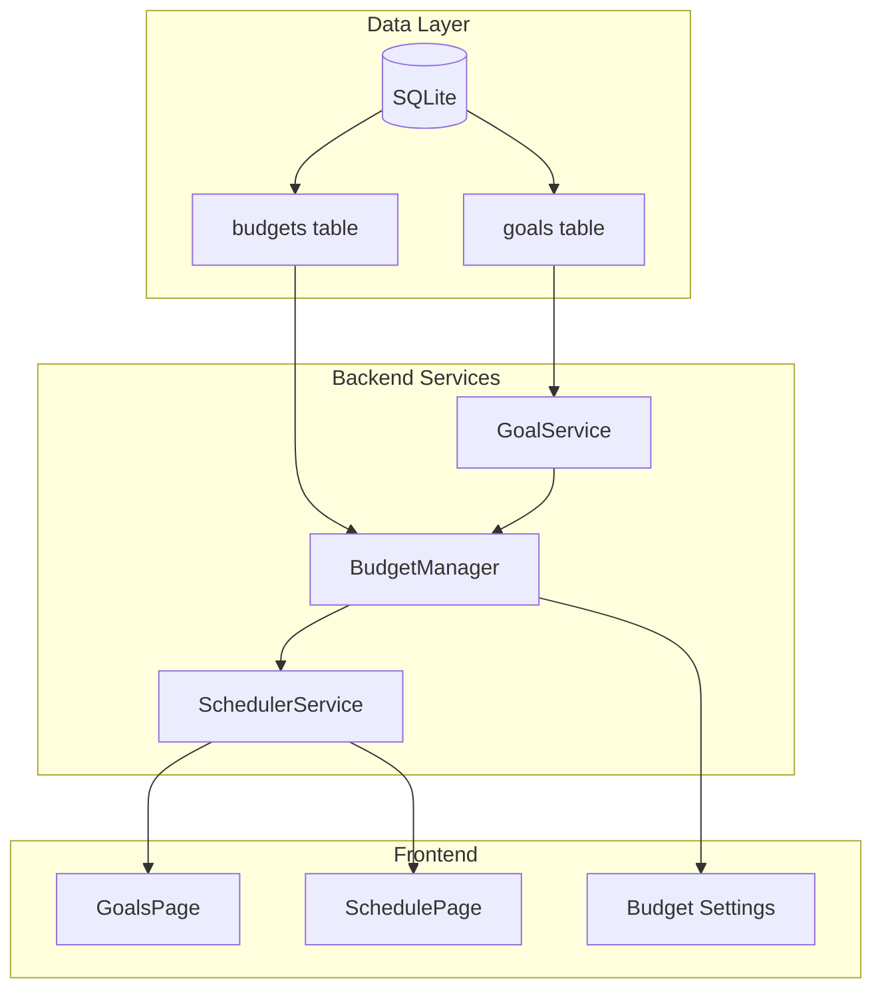

# Savings Goals Feature (v2.3.0)

## Overview

Implement a projection-based savings goals system where users define financial targets with deadlines. The scheduler calculates achievability and allocates surplus funds to goals by priority order, displaying goal deposits as separate line items in the schedule.

## Architecture



## Data Model

### New `goals` Table

```sql
CREATE TABLE goals (
  id TEXT PRIMARY KEY,
  budget_id TEXT NOT NULL,
  name TEXT NOT NULL,
  target_amount REAL NOT NULL,
  target_date TEXT NOT NULL,
  already_saved REAL DEFAULT 0,
  priority INTEGER DEFAULT 1,
  created_at TEXT NOT NULL,
  FOREIGN KEY (budget_id) REFERENCES budgets(id) ON DELETE CASCADE
);
```

### Budget Table Addition

Add `min_cash_on_hand` column to `budgets` table (default: 100).

### TypeScript Interfaces

```typescript
// src/types/index.ts
interface SavingsGoal {
  id: string;
  budgetId: string;
  name: string;
  targetAmount: number;
  targetDate: string;
  alreadySaved: number;
  priority: number;
  createdAt: string;
}

interface GoalProjection {
  goalId: string;
  goalName: string;
  targetAmount: number;
  alreadySaved: number;
  remainingAmount: number;
  requiredPerPaycheck: number;
  availablePerPaycheck: number;
  achievableAmount: number;
  achievabilityPercent: number;
  status: 'achievable' | 'partial' | 'impossible';
  suggestions: GoalSuggestion[];
}

interface GoalSuggestion {
  type: 'extend_deadline' | 'reduce_target' | 'increase_priority';
  description: string;
  newValue: string | number;
  resultPercent: number;
}
```

## Implementation Steps

### 1. Database Schema Changes
- Add migration v4 to [electron/services/database.service.ts](electron/services/database.service.ts)
- Create `goals` table with budget_id foreign key
- Add `min_cash_on_hand` column to `budgets` table
- Add Goal CRUD methods to DatabaseService

### 2. Backend Services
- Create `GoalService` in `electron/services/goal.service.ts` for goal CRUD
- Update [electron/services/budget-manager.service.ts](electron/services/budget-manager.service.ts) to route goal operations
- Update [electron/services/quick-budget.service.ts](electron/services/quick-budget.service.ts) for in-memory goal storage

### 3. Scheduler Integration
- Update [electron/services/scheduler.service.ts](electron/services/scheduler.service.ts):
  - Add `calculateGoalProjections()` method
  - Modify `buildPaycheckEntries()` to include goal deposits
  - Add goal deposit line items to `PaycheckBill` with new type `'goal'`
  - Generate suggestions for partial/impossible goals

### 4. IPC Handlers
- Update [electron/ipc/handlers.ts](electron/ipc/handlers.ts):
  - Add `goals:get-all`, `goals:create`, `goals:update`, `goals:delete` handlers
  - Modify `schedule:generate` to include goal projections in response
- Update [electron/preload.ts](electron/preload.ts) to expose goal APIs

### 5. Frontend Types
- Update [src/types/index.ts](src/types/index.ts) with `SavingsGoal`, `GoalProjection`, `GoalSuggestion`
- Update [src/types/electron.d.ts](src/types/electron.d.ts) with goal API definitions
- Add `minCashOnHand` to `Budget` interface

### 6. Goals Page UI
- Create `src/pages/GoalsPage.tsx`:
  - List all goals with achievability progress bars
  - Show per-paycheck impact and suggestions for partial goals
  - Add/Edit goal modal with name, amount, date, already saved, priority
  - Delete confirmation
- Add Goals nav item to [src/components/Layout.tsx](src/components/Layout.tsx)
- Add route to [src/App.tsx](src/App.tsx)

### 7. Schedule View Integration
- Update [src/pages/SchedulePage.tsx](src/pages/SchedulePage.tsx):
  - Display goal deposits as separate line items with "Goal:" prefix
  - Style goal line items distinctly (e.g., different icon)

### 8. Budget Settings Update
- Update [src/pages/BudgetsPage.tsx](src/pages/BudgetsPage.tsx) and [src/components/BudgetPicker.tsx](src/components/BudgetPicker.tsx):
  - Add "Minimum Cash on Hand" input field
  - Display both target and minimum in budget cards
- Update [src/context/BudgetContext.tsx](src/context/BudgetContext.tsx) for new field

### 9. Version and Polish
- Update [package.json](package.json) and [src/pages/SettingsPage.tsx](src/pages/SettingsPage.tsx) to v2.3.0
- Ensure A11y compliance for new components
- TypeScript compilation verification

## Risk Mitigation

| Risk | Mitigation |
|------|------------|
| Goals destabilize scheduler | Goals are calculated post-schedule; they consume surplus only |
| Priority conflicts | Clear priority ordering; lower priority goals get remaining surplus |
| Quick Budget complexity | In-memory goal storage mirrors persistent pattern |
| Performance with many goals | Goals sorted by priority; O(n) allocation per paycheck |

## Key Files Modified

- [electron/services/database.service.ts](electron/services/database.service.ts) - Schema, migrations, CRUD
- [electron/services/scheduler.service.ts](electron/services/scheduler.service.ts) - Goal projections, deposits
- [electron/services/budget-manager.service.ts](electron/services/budget-manager.service.ts) - Goal routing
- [electron/ipc/handlers.ts](electron/ipc/handlers.ts) - New IPC handlers
- [electron/preload.ts](electron/preload.ts) - API exposure
- [src/types/index.ts](src/types/index.ts) - Type definitions
- [src/pages/GoalsPage.tsx](src/pages/GoalsPage.tsx) - New page (create)
- [src/pages/SchedulePage.tsx](src/pages/SchedulePage.tsx) - Goal line items
- [src/components/Layout.tsx](src/components/Layout.tsx) - Navigation
