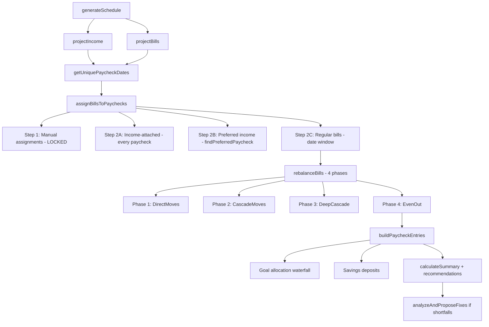
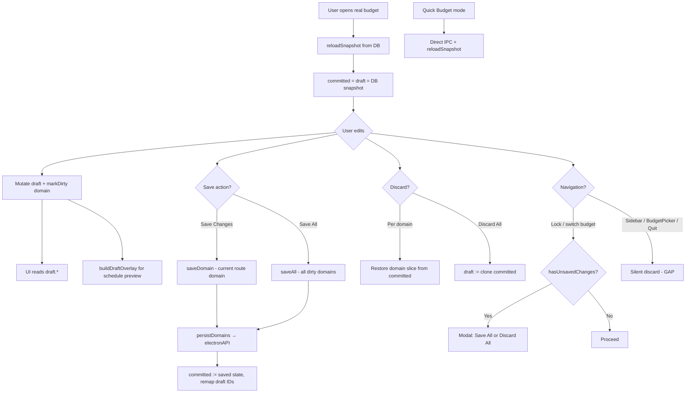

# Budget Optimizer — Functional Audit Report

**Version audited:** 2.8.0  
**Audit date:** June 10, 2026  
**Scope:** Static code review of `src/`, `electron/`, tests, and dependencies  
**Methodology:** Architecture tracing, security pattern review, algorithm analysis, draft-state flow mapping, dependency audit (`npm audit`), test suite execution (`vitest run`)

**Audit closure target:** June 2026  
**Baseline re-verified:** `main` @ d5e7624  
**Status:** CLOSED — all findings dispositioned (see [Audit Closure Summary](#audit-closure-summary))

**Post-3.0 / post-audit update (July 2026):** Exact windowed assignment engine + post-assignment rebalance (`targetCashOnHand` / `minCashOnHand`); `schedule:build` is the sole schedule IPC; `MIN_BREATHING_ROOM` removed. Architecture snowball closed (B-04, B-07, B-09, E-04 — `DataContext` removed). Electron 42 + always-probe ABI helper. SBOM artifact in CI quality job. Dependabot ignores Electron/TypeScript majors (#93). Living backlog: [CONTRIBUTING.md](CONTRIBUTING.md#post-audit-backlog) (only **5.4** LP solver remains open).

---

## Table of Contents

1. [Executive Summary](#executive-summary)
2. [Risk Scorecard](#risk-scorecard)
3. [Top 10 Findings](#top-10-findings)
4. [1. Security](#1-security)
5. [2. Efficiency](#2-efficiency)
6. [3. Limited Bloat](#3-limited-bloat)
7. [4. Algorithmic Intelligence](#4-algorithmic-intelligence)
8. [5. Volatile / Draft State](#5-volatile--draft-state)
9. [6. Additional Quality Checks](#6-additional-quality-checks)
10. [Prioritized Remediation Roadmap](#prioritized-remediation-roadmap)
11. [Appendix](#appendix)

---

## Executive Summary

Budget Optimizer is a well-structured local-first Electron finance application with a sound security foundation: context isolation, renderer sandboxing, parameterized SQL, and AES-256-GCM encryption for income and bill payloads. The draft/commit pattern ("volatile until Save") is architecturally coherent and recently implemented across the main editing surfaces.

However, this audit identifies **release-blocking security artifacts** (leftover debug telemetry that exfiltrates schedule metadata), **algorithm constraint gaps** (the 14-day early-payment rule is not uniformly enforced), and **efficiency bottlenecks** (full 12-month schedule regeneration on routine UI interactions). The scheduling engine is a capable heuristic rebalancer for typical biweekly scenarios, but it is not a global optimizer and can leave shortfalls or violate stated rules under sparse paycheck cadences or manual overrides.

**Overall posture:** Functional and thoughtfully designed for a v2.x desktop app, but not yet production-hardened without addressing Phase 0 items below.


| Domain                   | Grade  | Summary                                                              |
| ------------------------ | ------ | -------------------------------------------------------------------- |
| Security                 | **C+** | Strong Electron baseline; critical debug telemetry + IPC/export gaps |
| Efficiency               | **C**  | Correct local-first model; hot paths over-invoked                    |
| Limited Bloat            | **B-** | Lean test ratio; some dead deps and duplication                      |
| Algorithmic Intelligence | **B-** | Practical heuristic; constraint enforcement incomplete               |
| Volatile / Draft State   | **B+** | Well-architected; navigation and cross-domain gaps                   |
| Additional Quality       | **C+** | Docs drift, thin integration tests, dependency hygiene gaps          |


### Current Status

*Updated June 15, 2026 against `main` @ d5e7624.*

Substantial remediation since the June 10 audit. Revised approximate posture:


| Domain                   | June 10 grade | Current posture                                                               |
| ------------------------ | ------------- | ----------------------------------------------------------------------------- |
| Security                 | C+            | **B** — Phase 0/4 items largely closed (12/14 S-* findings)                   |
| Efficiency               | C             | **B-** — PR #26 + #53 closed most E-* hot paths                               |
| Limited Bloat            | B-            | **B** — scheduler modularized; B-02/B-03/B-06 closed; B-04/B-07–B-09 deferred |
| Algorithmic Intelligence | B-            | **B** — prepay cap and dedup fixed; A-03, A-08 accepted                       |
| Volatile / Draft State   | B+            | **A-** — Phase 2 complete (#52–#55); V-07 accepted                            |
| Additional Quality       | C+            | **B-** — tests, CI, docs greatly improved; bloat/E2E gaps remain              |


**Closure summary:** All release-blockers and draft-hardening items closed. Post-audit backlog reduced to optional **5.4** (LP solver). Architecture polish (B-04, B-07–B-09, E-04), Electron 42, E2E, and SBOM are closed. See [Audit Closure Summary](#audit-closure-summary).

Original grades in the table above are unchanged; this block supersedes them for planning purposes only.

---

## Risk Scorecard


| Severity     | Count | Representative issues                                                                                                  |
| ------------ | ----- | ---------------------------------------------------------------------------------------------------------------------- |
| **Critical** | 1     | Debug telemetry exfiltrating financial schedule data (S-01)                                                            |
| **High**     | 12    | Unguarded credentials IPC, HTML export XSS, plaintext goals/debts, algorithm constraint gaps, schedule over-generation |
| **Medium**   | 18    | Auto-lock broken, draft navigation gaps, duplicate utilities, IPC path divergence                                      |
| **Low**      | 10    | Redundant deps, large page components, terminology mismatch                                                            |
| **Info**     | 3     | README inaccuracies, naming overpromises                                                                               |


### Current Status

*Updated June 15, 2026 against `main` @ d5e7624.*

The severity counts in the table above reflect the **June 10, 2026 baseline only** and are not updated in place. Final disposition on current `main` (see [Audit Closure Summary](#audit-closure-summary)):


| Domain               | Closed  | Accepted       | Deferred |
| -------------------- | ------- | -------------- | -------- |
| Security (S-*)       | 13 / 14 | 1 (S-10)       | 0        |
| Volatile (V-*)       | 7 / 8   | 1 (V-07)       | 0        |
| Efficiency (E-*)     | 10 / 10 | 0              | 0        |
| Algorithm (A-*)      | 6 / 8   | 2 (A-03, A-08) | 0        |
| Bloat (B-*)          | 10 / 10 | 0              | 0        |
| Data integrity (D-*) | 3 / 5   | 2 (D-04, D-05) | 0        |


The original Critical count (S-01) is **resolved**. Zero findings remain Open or Partial without a final disposition.

---

## Top 10 Findings


| Rank | ID   | Finding                                                                                      | Domain     |
| ---- | ---- | -------------------------------------------------------------------------------------------- | ---------- |
| 1    | S-01 | Leftover `#region agent log` code writes schedule data to disk and POSTs to localhost ingest | Security   |
| 2    | A-01 | Initial bill assignment can place bills >14 days early on sparse paycheck cadences           | Algorithm  |
| 3    | S-02 | `credentials:get` returns OS keychain password without unlock guard                          | Security   |
| 4    | E-01 | Goals page runs full 12-month schedule to show projections only                              | Efficiency |
| 5    | A-02 | Manual drag-drop bill assignment has no never-late / ≤14-day validation                      | Algorithm  |
| 6    | S-03 | HTML export interpolates user strings without escaping (XSS)                                 | Security   |
| 7    | V-01 | Unsaved draft changes silently discarded on most navigation                                  | Volatile   |
| 8    | E-02 | Schedule regenerated on every edit without debounce or cache                                 | Efficiency |
| 9    | S-04 | Goals, debts, budget metadata stored in plaintext SQLite                                     | Security   |
| 10   | E-03 | `reloadSnapshot()` triggers 6–7 IPC round trips per CRUD refresh                             | Efficiency |


### Current Status

*Updated June 15, 2026 against `main` @ d5e7624.*


| Rank | ID   | Status     | Resolution                                                            |
| ---- | ---- | ---------- | --------------------------------------------------------------------- |
| 1    | S-01 | **Closed** | Telemetry removed + CI grep guards                                    |
| 2    | A-01 | **Closed** | `MAX_PREPAY_DAYS` in assignment step 2C                               |
| 3    | S-02 | **Closed** | `requireUnlocked` + gated IPC                                         |
| 4    | E-01 | **Closed** | Lightweight `generateGoalProjections()` skips rebalance loop (PR #26) |
| 5    | A-02 | **Closed** | Confirm-before-override on Schedule; documented in CONTRIBUTING       |
| 6    | S-03 | **Closed** | `escapeHtml` in PDF/HTML export                                       |
| 7    | V-01 | **Closed** | Sidebar, Settings, Quit, Lock, budget switch guarded (PR #52)         |
| 8    | E-02 | **Closed** | Debounce + cache + `scheduleInputHash` (PR #26, #53)                  |
| 9    | S-04 | **Closed** | v9/v10 encryption migrations                                          |
| 10   | E-03 | **Closed** | `budget:get-snapshot` single IPC (PR #26)                             |


---

## 1. Security

**Overall grade: C+ (Concern)**

### Strengths


| Control                      | Location                                | Notes                                                               |
| ---------------------------- | --------------------------------------- | ------------------------------------------------------------------- |
| Context isolation + sandbox  | `electron/main.ts`                      | `nodeIntegration: false`, `contextIsolation: true`, `sandbox: true` |
| Preload bridge               | `electron/preload.ts`                   | Fixed API surface via `contextBridge`                               |
| Parameterized SQL            | `electron/services/database.service.ts` | All user data paths use `?` placeholders via better-sqlite3         |
| Encryption at rest (partial) | `electron/services/crypto.service.ts`   | AES-256-GCM; PBKDF2-SHA512 at **310,000** iterations                |
| Password handling            | `electron/services/auth.service.ts`     | Hash-only storage; `secureCompare` for verification                 |
| Logger redaction             | `electron/services/logger.service.ts`   | Redacts keys matching `password`, `token`, `secret`, etc.           |
| PDF generation isolation     | `electron/services/pdf.service.ts`      | Hidden window with `javascript: false` for printToPDF               |


### Findings

#### S-01 — Debug telemetry exfiltrates financial metadata


| Field              | Value                                                                                                                                                                                                                                                                                                         |
| ------------------ | ------------------------------------------------------------------------------------------------------------------------------------------------------------------------------------------------------------------------------------------------------------------------------------------------------------- |
| **Severity**       | Critical                                                                                                                                                                                                                                                                                                      |
| **Location**       | `electron/services/scheduler.service.ts` (lines 580–584), `src/pages/SchedulePage.tsx` (lines 266–267), `src/components/schedule/PaycheckView.tsx` (lines 114–115)                                                                                                                                            |
| **Description**    | Leftover `#region agent log` instrumentation from a prior debugging session remains in production code paths. The main process appends paycheck bill-assignment data to a hardcoded file path. The renderer POSTs drag-drop and filter events to `http://127.0.0.1:7289/ingest/...` with session ID `f84ef2`. |
| **Impact**         | Financial scheduling metadata (bill IDs, due dates, paycheck dates, assignment counts) leaves the intended trust boundary. On a machine with the ingest server running, data is transmitted off-process. The hardcoded path also leaks developer machine structure.                                           |
| **Recommendation** | Remove all `#region agent log` blocks before any release. Add a pre-commit or CI grep rule to block debug telemetry patterns.                                                                                                                                                                                 |


```580:584:electron/services/scheduler.service.ts
    // #region agent log
    const fs = require('fs') as typeof import('fs');
    const debugPayload = {sessionId:'f84ef2',location:'scheduler.service.ts:assignBillsToPaychecks',message:'paycheck bill assignment result',data:{...},timestamp:Date.now(),hypothesisId:'B'};
    try { fs.appendFileSync('/Users/davismi/Repos/budget_optimizer/.cursor/debug-f84ef2.log', JSON.stringify(debugPayload)+'\n'); } catch { /* ignore */ }
    // #endregion
```

#### S-02 — Sensitive IPC handlers lack centralized unlock guards


| Field              | Value                                                                                                                                                                                                                                                                                                                                   |
| ------------------ | --------------------------------------------------------------------------------------------------------------------------------------------------------------------------------------------------------------------------------------------------------------------------------------------------------------------------------------- |
| **Severity**       | High                                                                                                                                                                                                                                                                                                                                    |
| **Location**       | `electron/ipc/handlers.ts`                                                                                                                                                                                                                                                                                                              |
| **Description**    | Many handlers check that `budgetManager`/`database` are initialized (implying prior unlock), but several critical channels have no `getIsUnlocked()` guard: `credentials:get/save/delete`, `export:to-pdf/to-html/to-spreadsheet`, `auth:get-pending-recovery-key`. Export handlers also accept arbitrary `filePath` from the renderer. |
| **Impact**         | Any renderer compromise (XSS, compromised extension, DevTools in dev builds) could read the saved master password from OS keychain, retrieve the pending recovery key, or write exported content to arbitrary writable paths.                                                                                                           |
| **Recommendation** | Introduce a `requireUnlocked(event)` middleware applied to all sensitive handlers. Restrict export paths to dialog-selected locations or an allowlisted directory (e.g., user Downloads).                                                                                                                                               |


```213:219:electron/ipc/handlers.ts
  ipcMain.handle('credentials:save', async (_, password: string) => {
    return services.credentials.savePassword(password);
  });

  ipcMain.handle('credentials:get', async () => {
    return services.credentials.getPassword();
  });
```

#### S-03 — HTML export XSS via unescaped user strings


| Field              | Value                                                                                                                                                                                                                 |
| ------------------ | --------------------------------------------------------------------------------------------------------------------------------------------------------------------------------------------------------------------- |
| **Severity**       | High                                                                                                                                                                                                                  |
| **Location**       | `electron/services/pdf.service.ts` (`generateHtml`)                                                                                                                                                                   |
| **Description**    | User-controlled strings (`src.name`, `bill.creditorName`, `gd.goalName`, recommendation text) are interpolated directly into HTML template literals without escaping.                                                 |
| **Impact**         | A malicious creditor or goal name (e.g., ``) executes JavaScript when the exported `.html` file is opened in a browser. PDF export is lower risk (sandboxed window, `javascript: false`). |
| **Recommendation** | HTML-escape all dynamic strings before interpolation, or use a templating library with auto-escaping.                                                                                                                 |


```145:149:electron/services/pdf.service.ts
          ${paycheck.incomeSources.map(src => `
            <div class="row row-income">
              <span class="row-label">${src.name}</span>
              <span class="row-amount income">+${formatCurrency(src.amount)}</span>
            </div>
```

#### S-04 — Significant financial metadata stored in plaintext


| Field              | Value                                                                                                                                                                                   |
| ------------------ | --------------------------------------------------------------------------------------------------------------------------------------------------------------------------------------- |
| **Severity**       | High                                                                                                                                                                                    |
| **Location**       | `electron/services/database.service.ts`                                                                                                                                                 |
| **Description**    | Only `incomes.data` and `bills.data` JSON blobs are encrypted. Budget names/balances, goal names/targets, debt principal/APR, and junction table metadata are plaintext SQLite columns. |
| **Impact**         | Copying `budget-data.db` exposes financial structure even without the master password. README overstates protection ("All sensitive data … is encrypted").                              |
| **Recommendation** | Either encrypt remaining columns (with migration) or revise documentation to accurately describe the threat model.                                                                      |


#### S-05 — Auto-lock timer never resets on activity


| Field              | Value                                                                                                                                                                     |
| ------------------ | ------------------------------------------------------------------------------------------------------------------------------------------------------------------------- |
| **Severity**       | Medium                                                                                                                                                                    |
| **Location**       | `electron/services/auth.service.ts`                                                                                                                                       |
| **Description**    | `resetAutoLock()` exists but is never called anywhere in the codebase. Timer only starts when user changes auto-lock duration in Settings—not on unlock or user activity. |
| **Impact**         | Auto-lock feature is effectively non-functional for its intended purpose.                                                                                                 |
| **Recommendation** | Call `resetAutoLock` on successful unlock and on user activity events (IPC heartbeat or renderer activity listener).                                                      |


#### S-06 — CSP allows unsafe directives; stale Google OAuth origins


| Field              | Value                                                                                                                                                                                                             |
| ------------------ | ----------------------------------------------------------------------------------------------------------------------------------------------------------------------------------------------------------------- |
| **Severity**       | Medium                                                                                                                                                                                                            |
| **Location**       | `index.html`                                                                                                                                                                                                      |
| **Description**    | CSP includes `script-src 'unsafe-inline' 'unsafe-eval'`. `connect-src` allows Google OAuth/Sheets APIs, but `google.service.ts` no longer exists. `font-src` is missing while Google Fonts are loaded externally. |
| **Impact**         | Weakened XSS mitigation in production builds; stale origins increase attack surface documentation drift.                                                                                                          |
| **Recommendation** | Tighten CSP for production builds (drop `unsafe-eval`); remove unused Google origins; add `font-src`.                                                                                                             |


#### S-07 — Settings update accepts arbitrary keys


| Field              | Value                                                                                                                        |
| ------------------ | ---------------------------------------------------------------------------------------------------------------------------- |
| **Severity**       | Medium                                                                                                                       |
| **Location**       | `electron/services/database.service.ts` (`updateSettings`)                                                                   |
| **Description**    | Any key/value pair from the renderer is upserted into the settings table without allowlisting.                               |
| **Impact**         | Settings pollution; potential prototype-chain issues if keys like `__proto__` are passed and merged back onto `AppSettings`. |
| **Recommendation** | Allowlist known setting keys; reject unknown keys at validation layer.                                                       |


#### S-08 — No brute-force rate limiting on auth channels


| Field              | Value                                                                                                       |
| ------------------ | ----------------------------------------------------------------------------------------------------------- |
| **Severity**       | Medium                                                                                                      |
| **Location**       | `electron/ipc/handlers.ts` (`auth:unlock`, `auth:verify-recovery-key`, `auth:reset-password-with-recovery`) |
| **Description**    | No lockout, delay, or attempt counter on password/recovery verification.                                    |
| **Impact**         | Unlimited offline master password attempts against local hash.                                              |
| **Recommendation** | Add exponential backoff after N failed attempts; optional lockout period.                                   |


#### S-09 — Password change silently overwrites keychain


| Field              | Value                                                                                                                   |
| ------------------ | ----------------------------------------------------------------------------------------------------------------------- |
| **Severity**       | Medium                                                                                                                  |
| **Location**       | `electron/ipc/handlers.ts` (`auth:change-password`)                                                                     |
| **Description**    | On successful password change, keychain is updated without user consent (unlike `credentials:offerSave` which prompts). |
| **Impact**         | Unexpected credential store mutation.                                                                                   |
| **Recommendation** | Use `offerSave` pattern or explicit user confirmation.                                                                  |


#### S-10 — Legacy recovery key static salt fallback


| Field              | Value                                                                                          |
| ------------------ | ---------------------------------------------------------------------------------------------- |
| **Severity**       | Medium                                                                                         |
| **Location**       | `electron/services/crypto.service.ts`                                                          |
| **Description**    | Recovery key KDF falls back to static salt `budget-optimizer-recovery-v1` for legacy accounts. |
| **Impact**         | Weaker KDF for accounts created before per-user recovery salts.                                |
| **Recommendation** | Migration path to per-user salts on next unlock.                                               |


#### S-11 — SQLite DB file permissions not hardened


| Field              | Value                                                                                               |
| ------------------ | --------------------------------------------------------------------------------------------------- |
| **Severity**       | Low                                                                                                 |
| **Location**       | `electron/services/database.service.ts`                                                             |
| **Description**    | `auth.config` uses mode `0o600`; `budget-data.db` created without explicit restrictive permissions. |
| **Recommendation** | Set `0o600` on DB file at creation.                                                                 |


#### S-12 — DevTools auto-opened in development


| Field           | Value                                                                      |
| --------------- | -------------------------------------------------------------------------- |
| **Severity**    | Low                                                                        |
| **Location**    | `electron/main.ts`                                                         |
| **Description** | `mainWindow.webContents.openDevTools()` when `VITE_DEV_SERVER_URL` is set. |
| **Impact**      | Expected for dev; ensure production builds never set this flag.            |


#### S-13 — Partial input validation coverage


| Field              | Value                                                                                                     |
| ------------------ | --------------------------------------------------------------------------------------------------------- |
| **Severity**       | Low                                                                                                       |
| **Location**       | `electron/services/validation.service.ts` vs `database.service.ts`                                        |
| **Description**    | Bills and income are validated; goals, debts, budgets, settings, and reconciliation fix payloads are not. |
| **Recommendation** | Extend validation service to all write paths.                                                             |


#### S-14 — Draft overlay trusts renderer-shaped objects


| Field              | Value                                                                         |
| ------------------ | ----------------------------------------------------------------------------- |
| **Severity**       | Low                                                                           |
| **Location**       | `electron/services/draft-overlay.service.ts`                                  |
| **Description**    | Overlay arrays from IPC are merged without re-validation on the main process. |
| **Recommendation** | Re-validate overlay payloads server-side before schedule computation.         |


### Current Status

*Updated June 15, 2026 against `main` @ d5e7624.*


| ID   | Status       | Notes                                                                                          |
| ---- | ------------ | ---------------------------------------------------------------------------------------------- |
| S-01 | **Closed**   | Debug telemetry removed; CI grep + packaged-app guards                                         |
| S-02 | **Closed**   | `requireUnlocked` / `withUnlockGuard`; credentials + export gated                              |
| S-03 | **Closed**   | `escapeHtml` on all dynamic export strings                                                     |
| S-04 | **Closed**   | v9/v10 migrations encrypt goals, debts, budget metadata, schedule junction data                |
| S-05 | **Closed**   | Auto-lock resets on unlock + activity pings from Layout                                        |
| S-06 | **Closed**   | Production CSP tightened; stale Google OAuth origins removed                                   |
| S-07 | **Closed**   | Settings key allowlist in `validation.service.ts`                                              |
| S-08 | **Closed**   | Auth rate limiting with backoff and lockout                                                    |
| S-09 | **Closed**   | Password change uses `credentials.offerSave()`                                                 |
| S-10 | **Accepted** | Static recovery salt fallback removed; legacy accounts without `recoverySalt` blocked at reset |
| S-11 | **Closed**   | DB file chmod `0o600` on initialize                                                            |
| S-12 | **Closed**   | DevTools only in unpackaged dev builds                                                         |
| S-13 | **Closed**   | `validateSkippedBill()` / `validateBillAssignment()` on skip/assign IPC paths                  |
| S-14 | **Closed**   | `validateDraftOverlay()` before schedule computation                                           |


Key commits: `35d1133`, `6fa05a0`, `13f8b21`, `5a1fa68`, `cfd0588`.

---

## 2. Efficiency

**Overall grade: C (Concern)**

### Strengths

- Heavy native dependencies (`exceljs`, `better-sqlite3`, `keytar`) correctly externalized in `vite.config.ts` — not bundled into renderer.
- SQLite uses WAL mode, prepared statements, and transactions.
- Recent utility extractions reduce UI duplication: `src/utils/cadence.ts`, `src/utils/scheduleBills.ts`.
- Paycheck date math centralized in `electron/utils/paycheck-calculator.ts` (not duplicated in renderer).

### Findings

#### E-01 — Goals page runs full 12-month schedule for projections only


| Field              | Value                                                                                                                                                                                               |
| ------------------ | --------------------------------------------------------------------------------------------------------------------------------------------------------------------------------------------------- |
| **Severity**       | High                                                                                                                                                                                                |
| **Location**       | `electron/ipc/handlers.ts` (`goals:get-projections`), `src/pages/GoalsPage.tsx`                                                                                                                     |
| **Description**    | IPC handler calls `scheduler.generateSchedule(..., SCHEDULE_CALCULATION_MONTHS)` (12 months) and returns only `goalProjections`. GoalsPage re-runs on `draft.goals` or `dirtyDomains.size` changes. |
| **Impact**         | One of the heaviest codepaths executes on a page that only needs goal allocation math (~1,686-line scheduler service).                                                                              |
| **Recommendation** | Extract `calculateGoalProjections()` as a standalone function that does not require full bill assignment/rebalance.                                                                                 |


#### E-02 — Schedule regenerated on every edit without debounce or cache


| Field              | Value                                                                                                                                                                                                                                                                        |
| ------------------ | ---------------------------------------------------------------------------------------------------------------------------------------------------------------------------------------------------------------------------------------------------------------------------- |
| **Severity**       | High                                                                                                                                                                                                                                                                         |
| **Location**       | `src/pages/DashboardPage.tsx`, `src/pages/SchedulePage.tsx`, `src/context/DataContext.tsx`                                                                                                                                                                                   |
| **Description**    | `generateSchedule` → IPC `schedule:optimize` → full `SchedulerService.generateSchedule` on main process. Dashboard regens when incomes/bills change. SchedulePage regens on `dataHash` changes including every drag-drop assignment. No debounce, no input-hash memoization. |
| **Impact**         | Main-thread CPU spikes; perceptible UI stalls during interactive schedule editing.                                                                                                                                                                                           |
| **Recommendation** | Debounce schedule calls (300–500ms); cache by `(overlayHash, startDate, months, startingBalance)`; consider incremental paycheck-window invalidation.                                                                                                                        |


#### E-03 — `reloadSnapshot()` = 6–7 parallel IPC round trips


| Field              | Value                                                                                                                                                                                                                                                                               |
| ------------------ | ----------------------------------------------------------------------------------------------------------------------------------------------------------------------------------------------------------------------------------------------------------------------------------- |
| **Severity**       | High                                                                                                                                                                                                                                                                                |
| **Location**       | `src/context/DraftContext.tsx` (lines 125–197)                                                                                                                                                                                                                                      |
| **Description**    | Parallel calls to `income.getAll`, `bills.getAll`, `goals.getAll`, `skippedBills.getAll`, `billAssignments.getAll`, `incomeOverrides.getAll`, `debts.getAll` — each IPC + DB query + decrypt (for incomes/bills). Called after most CRUD in Quick Budget mode and on budget switch. |
| **Impact**         | Latency stacks on every save/skip/assign; decrypt is O(n) per entity type.                                                                                                                                                                                                          |
| **Recommendation** | Add single `budget:get-snapshot` IPC returning all budget-scoped data in one transaction. Update only mutated slices client-side after writes.                                                                                                                                      |


#### E-04 — Global DraftContext causes broad re-renders


| Field              | Value                                                                                                                                                   |
| ------------------ | ------------------------------------------------------------------------------------------------------------------------------------------------------- |
| **Severity**       | Medium                                                                                                                                                  |
| **Location**       | `src/context/DraftContext.tsx` (778 lines), `src/App.tsx`                                                                                               |
| **Description**    | Provider wraps entire app. Context `value` useMemo depends on entire `draft` object; any mutation recreates value. Zero `React.memo` usage in codebase. |
| **Impact**         | Typing in Bills/Income forms can re-render Layout, nav, and unrelated pages.                                                                            |
| **Recommendation** | Split into data vs actions contexts, or adopt selector pattern (Zustand/jotai). Memoize heavy children (`PaycheckView`, debt lists).                    |


#### E-05 — No route-level code splitting


| Field              | Value                                                                                     |
| ------------------ | ----------------------------------------------------------------------------------------- |
| **Severity**       | Medium                                                                                    |
| **Location**       | `src/App.tsx`                                                                             |
| **Description**    | All 11 pages imported eagerly; no `React.lazy` / `Suspense`.                              |
| **Impact**         | Initial renderer bundle includes every page, including chart-heavy pages with `recharts`. |
| **Recommendation** | Lazy-load `DebtsPage`, `SummaryPage`, `SchedulePage`, `ExportPage`, `SettingsPage`.       |


#### E-06 — Divergent schedule IPC paths


| Field              | Value                                                                                                                                                                                                           |
| ------------------ | --------------------------------------------------------------------------------------------------------------------------------------------------------------------------------------------------------------- |
| **Severity**       | Medium                                                                                                                                                                                                          |
| **Location**       | `electron/ipc/handlers.ts`, `electron/preload.ts`                                                                                                                                                               |
| **Description**    | `schedule:generate` (12-mo calc + viewport filter + bill dedup + reconciliation) is exposed in preload but never called from `src/`. Renderer uses only `schedule:optimize`, which skips post-processing steps. |
| **Impact**         | Dead code path with different behavior; maintenance hazard if re-enabled without alignment.                                                                                                                     |
| **Recommendation** | Consolidate to one handler or remove unused path from preload.                                                                                                                                                  |


#### E-07 — `structuredClone` on every snapshot reload


| Field              | Value                                                          |
| ------------------ | -------------------------------------------------------------- |
| **Severity**       | Medium                                                         |
| **Location**       | `src/context/DraftContext.tsx`                                 |
| **Description**    | Full deep clone of all budget data on each `reloadSnapshot()`. |
| **Impact**         | Memory allocation churn proportional to dataset size.          |
| **Recommendation** | Immutable updates for draft edits; clone only dirty domains.   |


#### E-08 — `recharts` on three pages without lazy loading


| Field              | Value                                                                                                       |
| ------------------ | ----------------------------------------------------------------------------------------------------------- |
| **Severity**       | Medium                                                                                                      |
| **Location**       | `DashboardPage.tsx`, `DebtsPage.tsx`, `SummaryPage.tsx`                                                     |
| **Description**    | `recharts` (~150–250KB+ gzipped) imported statically; SummaryPage uses widest API surface (Area, Bar, Pie). |
| **Recommendation** | Dynamic import inside chart components or lazy-load chart pages.                                            |


#### E-09 — Monolithic scheduler module loaded for any schedule call


| Field              | Value                                                                                   |
| ------------------ | --------------------------------------------------------------------------------------- |
| **Severity**       | Low                                                                                     |
| **Location**       | `electron/services/scheduler.service.ts` (1,686 lines)                                  |
| **Description**    | Entire module loads for any schedule invocation including lightweight projection needs. |
| **Recommendation** | Split into focused modules for targeted caching and smaller hot paths.                  |


#### E-10 — Vite build has no chunking strategy


| Field              | Value                                                                                               |
| ------------------ | --------------------------------------------------------------------------------------------------- |
| **Severity**       | Low                                                                                                 |
| **Location**       | `vite.config.ts`                                                                                    |
| **Description**    | No `manualChunks`, no bundle analyzer configured.                                                   |
| **Recommendation** | Add `rollup-plugin-visualizer`; configure vendor chunks for `recharts`, `date-fns`, `lucide-react`. |


### Current Status

*Updated June 15, 2026 against `main` @ d5e7624.*


| ID   | Status       | Notes                                                                          |
| ---- | ------------ | ------------------------------------------------------------------------------ |
| E-01 | **Closed**   | `generateGoalProjections()` skips rebalance loop; tests assert parity (PR #26) |
| E-02 | **Closed**   | Debounce + in-memory cache + `scheduleInputHash` (PR #26, #53)                 |
| E-03 | **Closed**   | Single `budget:get-snapshot` IPC (PR #26)                                      |
| E-04 | **Closed**   | `DraftStatusContext` + memoization (#82)                               |
| E-05 | **Closed**   | Route lazy-loading in `App.tsx`                                                |
| E-06 | **Closed**   | Dead `schedule:generate` removed; single `schedule:build`                      |
| E-07 | **Closed**   | Shallow `copyDraftState()` on reload; `structuredClone` only on discard paths  |
| E-08 | **Closed**   | Charts lazy-loaded via `lazyCharts.tsx`; recharts vendor chunk                 |
| E-09 | **Closed**   | Scheduler modularized under `electron/services/scheduler/`; facade ~212 LOC    |
| E-10 | **Closed**   | `manualChunks` + optional bundle visualizer in `vite.config.ts`                |


Primary remediation: PR [#26](https://github.com/mdavis93/budget_optimizer/pull/26) (E-01–E-10).

---

## 3. Limited Bloat

**Overall grade: B- (Moderate Concern)**

The codebase is lean relative to its feature set. Production code is ~~19,487 LOC; tests are ~3,146 LOC (**~~16% ratio**). This is healthy—not over-tested on trivia, not under-tested on the scheduler core.

### Positive Signals

- No widespread dead code in business logic paths.
- Recent extractions (`cadence.ts`, `scheduleBills.ts`) show active de-bloating.
- Test investment concentrated where algorithmic risk is highest (`scheduler.service.test.ts` = 1,414 LOC).

### Findings

#### B-01 — Unused `@react-pdf/renderer` dependency


| Field              | Value                                                                                                               |
| ------------------ | ------------------------------------------------------------------------------------------------------------------- |
| **Severity**       | High                                                                                                                |
| **Location**       | `package.json`                                                                                                      |
| **Description**    | Listed in `dependencies`; zero imports in source. PDF export uses Chromium `printToPDF` via hidden `BrowserWindow`. |
| **Recommendation** | Remove from `package.json` and lockfile.                                                                            |


#### B-02 — `formatCurrency` duplicated across 12 files


| Field              | Value                                                                                                                                                                                                                                                                 |
| ------------------ | --------------------------------------------------------------------------------------------------------------------------------------------------------------------------------------------------------------------------------------------------------------------- |
| **Severity**       | Medium                                                                                                                                                                                                                                                                |
| **Location**       | `DashboardPage.tsx`, `BillsPage.tsx`, `IncomePage.tsx`, `SchedulePage.tsx`, `GoalsPage.tsx`, `SummaryPage.tsx`, `CalendarView.tsx`, `ReconciliationPage.tsx`, `PaycheckView.tsx`, `pdf.service.ts`, `scheduler.service.ts`, `electron/utils/constants.ts` (canonical) |
| **Recommendation** | Create `src/utils/formatCurrency.ts` (or shared isomorphic module) and import everywhere.                                                                                                                                                                             |


#### B-03 — `PRIORITY_LABELS` duplicated in export services


| Field              | Value                                                                        |
| ------------------ | ---------------------------------------------------------------------------- |
| **Severity**       | Medium                                                                       |
| **Location**       | `src/types/index.ts` (canonical), `pdf.service.ts`, `spreadsheet.service.ts` |
| **Recommendation** | Shared constants module imported by electron services.                       |


#### B-04 — Mirrored type definitions across layers


| Field              | Value                                                                                                                |
| ------------------ | -------------------------------------------------------------------------------------------------------------------- |
| **Severity**       | Medium                                                                                                               |
| **Location**       | `src/types/index.ts`, `electron/services/database.service.ts`, `src/types/electron.d.ts`                             |
| **Description**    | Entity types and IPC typings duplicated with drift risk. `database.service.ts` is 1,384 lines including row mappers. |
| **Recommendation** | Single shared `types/` package or path alias; DB layer keeps only row interfaces.                                    |


#### B-05 — God files: scheduler and IPC handlers


| Field              | Value                                                              |
| ------------------ | ------------------------------------------------------------------ |
| **Severity**       | Medium                                                             |
| **Location**       | `scheduler.service.ts` (1,686 LOC), `ipc/handlers.ts` (~1,190 LOC) |
| **Description**    | Maintainability concern, not runtime dead weight.                  |
| **Recommendation** | Split by domain when next touching these files.                    |


#### B-06 — Redundant direct dependencies


| Field              | Value                                                                                                                                                                       |
| ------------------ | --------------------------------------------------------------------------------------------------------------------------------------------------------------------------- |
| **Severity**       | Low                                                                                                                                                                         |
| **Location**       | `package.json`                                                                                                                                                              |
| **Description**    | `bindings`, `file-uri-to-path` are transitive deps of `better-sqlite3`. `uuid` used only in `quick-budget.service.ts` while `CryptoService.generateId()` is used elsewhere. |
| **Recommendation** | Remove redundant direct deps; standardize on `crypto.randomUUID()` or `CryptoService`.                                                                                      |


#### B-07 — Large page components


| Field              | Value                                                                                                                                          |
| ------------------ | ---------------------------------------------------------------------------------------------------------------------------------------------- |
| **Severity**       | Low                                                                                                                                            |
| **Location**       | `DebtsPage.tsx` (853 LOC), `SettingsPage.tsx` (640 LOC), `GoalsPage.tsx` (622 LOC), `SchedulePage.tsx` (562 LOC), `PaycheckView.tsx` (581 LOC) |
| **Description**    | Maintainability bloat, not dead code.                                                                                                          |
| **Recommendation** | Extract forms, chart wrappers, and sort/group helpers when next editing.                                                                       |


#### B-08 — `BudgetManager` mostly passthrough


| Field              | Value                                                                                                            |
| ------------------ | ---------------------------------------------------------------------------------------------------------------- |
| **Severity**       | Low                                                                                                              |
| **Location**       | `electron/services/budget-manager.service.ts` (389 lines)                                                        |
| **Description**    | Many methods delegate directly to `DatabaseService`; `getTargetCashOnHand` etc. call `getBudgetById` repeatedly. |
| **Recommendation** | Cache current budget on switch; collapse pure passthroughs.                                                      |


#### B-09 — `DataContext` thin facade over `DraftContext`


| Field              | Value                                                                        |
| ------------------ | ---------------------------------------------------------------------------- |
| **Severity**       | Low                                                                          |
| **Location**       | `src/context/DataContext.tsx`, `src/components/Layout.tsx`                   |
| **Description**    | Extra provider nesting; `incomes`/`bills` are pass-throughs from draft.      |
| **Recommendation** | Merge or expose schedule state from dedicated context to reduce indirection. |


#### B-10 — Duplicate debt-payoff logic in IPC handlers


| Field              | Value                                                                                 |
| ------------------ | ------------------------------------------------------------------------------------- |
| **Severity**       | Low                                                                                   |
| **Location**       | `electron/ipc/handlers.ts`                                                            |
| **Description**    | `buildDebtPayoffs()` helper exists but `schedule:generate` has inline duplicate loop. |
| **Recommendation** | Use helper everywhere.                                                                |


### Current Status

*Updated June 15, 2026 against `main` @ d5e7624.*


| ID   | Status       | Notes                                                                       |
| ---- | ------------ | --------------------------------------------------------------------------- |
| B-01 | **Closed**   | `@react-pdf/renderer` removed; PDF via Chromium `printToPDF`                |
| B-02 | **Closed**   | Shared `src/utils/formatCurrency.ts` replaces local copies                  |
| B-03 | **Closed**   | Shared `PRIORITY_LABELS` in `electron/utils/constants.ts`                   |
| B-04 | **Closed**   | Shared types module (`shared/`, #59)                                    |
| B-05 | **Closed**   | Scheduler split into `electron/services/scheduler/`; handler split deferred |
| B-06 | **Closed**   | Redundant direct deps removed; `crypto.randomUUID()` in quick-budget        |
| B-07 | **Closed**   | Presentational splits (#81)                                                 |
| B-08 | **Closed**   | BudgetManager current-budget cache                                          |
| B-09 | **Closed**   | DataContext → Draft schedule slice (#83; removed)                           |
| B-10 | **Closed**   | Shared `buildDebtPayoffs()` in handlers; inline duplicate removed           |


---

## 4. Algorithmic Intelligence

**Overall grade: B- (Moderate)**

This is the deepest audit domain. The product promise—*"optimize payment schedules to avoid shortfalls with bills budgeted up to two weeks early but never late"*—is **partially met**. The engine is a practical four-phase greedy rebalancer suited to common biweekly/weekly paycheck cadences, but it is not a global optimizer and has enforceable constraint gaps.

### Algorithm Architecture




**Core engine:** `electron/services/scheduler.service.ts` (1,686 lines)

**Supporting modules:**

- `electron/utils/paycheck-calculator.ts` — income date projection
- `electron/utils/constants.ts` — `PRIORITY_ORDER`
- `src/utils/cadence.ts` — monthly budget equivalence (UI only, not scheduling)
- `src/utils/scheduleBills.ts` — UI display filter for moved bills

### Key Constants

```27:30:electron/services/scheduler/types.ts
export const DEFAULT_TARGET_CASH_ON_HAND = 250;
export const DEFAULT_MIN_CASH_ON_HAND = 100;
export const MAX_PREPAY_DAYS = 14; // Bills cannot be paid more than 14 days early
```

Surplus and reconciliation use the user's target/min from `ScheduleData` (`maxBudgetRemaining`, `minCashOnHand`); `MIN_BREATHING_ROOM` was removed in 3.0.

### Assignment Pipeline Detail

#### Step 1: Manual assignments (locked from rebalance)

Bills with entries in `BillAssignment` map (`billId-billDueDate → paycheckDate`) are placed first and added to `manuallyAssignedBills` set. Rebalance `moveBill` refuses to relocate locked bills.

#### Step 2A: Income-attached bills

Placed on **every** paycheck from the attached income source. No due-date alignment or prepay cap applied.

#### Step 2B: Preferred income bills

`findPreferredPaycheck()` selects the paycheck closest to (but not after) the due date, enforcing `daysEarly ≤ MAX_PREPAY_DAYS`:

```396:412:electron/services/scheduler.service.ts
    // Find the best paycheck: closest to bill due date, but not more than MAX_PREPAY_DAYS early
    // ...
      if (isAfter(paycheck.date, bill.date)) continue;
      const daysEarly = differenceInDays(bill.date, paycheck.date);
      if (daysEarly > MAX_PREPAY_DAYS) continue;
```

#### Step 2C: Regular bills (date window)

Bills land on the first paycheck where `paycheckDate ≤ dueDate < nextPaycheckDate`:

```554:558:electron/services/scheduler.service.ts
        const isInDateRange = (
          (isAfter(billDate, paycheckDate) || isEqual(billDate, paycheckDate)) &&
          isBefore(billDate, nextPaycheckDate)
        );
```

**Gap:** No `MAX_PREPAY_DAYS` check here. Monthly paycheck on the 1st with bill due on the 28th → ~27 days early.

### Rebalancing Engine

Four greedy phases, each capped at 50–200 passes:


| Phase | Method                         | Strategy                                                            |
| ----- | ------------------------------ | ------------------------------------------------------------------- |
| 1     | `rebalancePhase1_DirectMoves`  | Move movable bills from deficit paycheck → earlier surplus paycheck |
| 2     | `rebalancePhase2_CascadeMoves` | Free space on mid paycheck, pull deficit bill forward               |
| 3     | `rebalancePhase3_DeepCascade`  | Chain smaller bill moves to create room for larger deficit bills    |
| 4     | `rebalancePhase4_EvenOut`      | Spread load when balance is tight ($50–$150 range) but not deficit  |


**Move rules (`moveBill`):**

- Blocked if bill is manually assigned (locked)
- Blocked if `daysEarly > 14`
- Movable bills: non-`critical`, sorted lowest priority first, then largest amount
- Critical bills never moved
- Moves are always to **earlier** paycheck indices (never pushes bills later)

**Rebalance balance model:**

- Per-paycheck: `income − bills` with $50 breathing room
- `startingBalance` is **not** used during rebalance (only in `buildPaycheckEntries` for paycheck #1)
- No inter-paycheck cash carry during rebalance

### Surplus Allocation (`buildPaycheckEntries`)

Waterfall per paycheck:

1. Reserve `minCashOnHand`
2. `minSavingsPerPaycheck`
3. Goals by priority (aggressive fill — glide-path helpers exist but are not used for actual allocation)
4. Remainder → additional savings

Shortfall = `budgetRemaining < 0`.

### Post-hoc Reconciliation (`analyzeAndProposeFixes`)

When shortfalls remain, proposes:

- `move_bill` — to earlier paycheck with surplus, respecting 14-day cap
- `skip_bill` — low/normal priority bills if moves insufficient

### Intelligence Assessment

#### What the algorithm optimizes for

- **Primary:** Eliminate per-paycheck deficits by prepaying bills within move constraints
- **Secondary:** Phase 4 evens out tight paychecks; priority-1 goals filled aggressively first
- **Tertiary:** Maintain $50–$100 breathing room per paycheck

#### What it does NOT optimize for

- Global minimum early payments (greedy first-fit, not optimal)
- Smoothed cash flow across the full schedule horizon
- Inter-paycheck surplus transfer without physically moving bills
- Combinatorial bill-packing (no knapsack, ILP, or constraint solver)
- Payment timing relative to creditor grace periods beyond assignment window

#### `optimizeSchedule` naming (historical)

**Closed in 3.0:** `optimizeSchedule()` was removed; the sole IPC path is `schedule:build` → `generateSchedule()`.

### Constraint Compliance Matrix


| Rule                         | Auto assignment (2C)                | Rebalance moves    | Manual drag-drop            | Reconciliation proposals |
| ---------------------------- | ----------------------------------- | ------------------ | --------------------------- | ------------------------ |
| **≤ 14 days early**          | **Partial** — no cap in date window | Yes                | **No validation**           | Yes                      |
| **Never late**               | Yes (window logic)                  | Yes (earlier only) | **No validation**           | Yes (earlier only)       |
| **Critical bills immovable** | N/A                                 | Yes                | Locked if manually assigned | Skips critical           |


### Algorithm Findings

#### A-01 — Initial assignment can violate 14-day early cap


| Field              | Value                                                                                                                                                                                                                                                              |
| ------------------ | ------------------------------------------------------------------------------------------------------------------------------------------------------------------------------------------------------------------------------------------------------------------ |
| **Severity**       | High                                                                                                                                                                                                                                                               |
| **Location**       | `scheduler.service.ts` lines 541–568 (step 2C)                                                                                                                                                                                                                     |
| **Description**    | Date-window assignment has no `MAX_PREPAY_DAYS` check. Sparse paycheck cadences (monthly, semi-monthly with wide gaps) can place bills far earlier than 14 days. Rebalance may pull bills even earlier but cannot push them later to correct over-early placement. |
| **Impact**         | Product rule "budgeted up to two weeks early" violated in automatic mode for common monthly-income scenarios.                                                                                                                                                      |
| **Recommendation** | In step 2C, select the latest eligible paycheck within 14 days of due date, not the first window match. Add test: monthly paycheck + day-28 bill.                                                                                                                  |


#### A-02 — Manual bill assignment has no constraint validation


| Field              | Value                                                                                                                                                                                   |
| ------------------ | --------------------------------------------------------------------------------------------------------------------------------------------------------------------------------------- |
| **Severity**       | High                                                                                                                                                                                    |
| **Location**       | `src/context/DraftContext.tsx` (`assignBill`, lines 532–552), `src/pages/SchedulePage.tsx` (`handleDrop`)                                                                               |
| **Description**    | `assignBill(billId, billDueDate, paycheckDate)` accepts any target date. No check that `paycheckDate ≤ billDueDate` (never late) or `differenceInDays(billDueDate, paycheckDate) ≤ 14`. |
| **Impact**         | User can create late or excessively early assignments that persist until Save and lock from auto-rebalance.                                                                             |
| **Recommendation** | Validate in `assignBill` and/or `handleDrop`; show UI feedback on constraint violation.                                                                                                 |


#### A-03 — Income-attached bills ignore due-date and prepay constraints


| Field              | Value                                                                                                                    |
| ------------------ | ------------------------------------------------------------------------------------------------------------------------ |
| **Severity**       | Medium                                                                                                                   |
| **Location**       | `scheduler.service.ts` (step 2A)                                                                                         |
| **Description**    | Income-attached bills appear on every paycheck from the attached income source regardless of bill due day or 14-day cap. |
| **Impact**         | May over-allocate bills across paychecks; contradicts scheduling semantics for date-based bills.                         |
| **Recommendation** | Document as intentional behavior or align with due-date window + prepay cap.                                             |


#### A-04 — IPC post-processing diverges from `buildPaycheckEntries`


| Field              | Value                                                                                                                                                                                                                                                            |
| ------------------ | ---------------------------------------------------------------------------------------------------------------------------------------------------------------------------------------------------------------------------------------------------------------- |
| **Severity**       | Medium                                                                                                                                                                                                                                                           |
| **Location**       | `electron/ipc/handlers.ts` (`schedule:generate`, lines 831–854)                                                                                                                                                                                                  |
| **Description**    | Handler recalculates `budgetRemaining`/`savingsDeposit` using `targetCashOnHand` only, diverging from `buildPaycheckEntries` logic (`minCashOnHand`, `minSavingsPerPaycheck`, first-paycheck boost). Handler is unused by renderer today but remains in preload. |
| **Impact**         | Dead path risk; if re-enabled, display/compute mismatch.                                                                                                                                                                                                         |
| **Recommendation** | Remove or align with scheduler output.                                                                                                                                                                                                                           |


#### A-05 — Deduplication key mismatch


| Field              | Value                                                                                                  |
| ------------------ | ------------------------------------------------------------------------------------------------------ |
| **Severity**       | Medium                                                                                                 |
| **Location**       | `scheduler.service.ts` (line 590: `billId-creditorName-dueDay`) vs `handlers.ts` (creditorName-dueDay) |
| **Description**    | Different dedup keys can collapse or fail to collapse distinct bill occurrences.                       |
| **Impact**         | Duplicate bills in UI or missing bills in dedup.                                                       |
| **Recommendation** | Standardize on `billId-date` key everywhere.                                                           |


#### A-06 — `optimizeSchedule` is not a distinct optimizer


| Field              | Value                                                                              |
| ------------------ | ---------------------------------------------------------------------------------- |
| **Severity**       | Medium                                                                             |
| **Location**       | `scheduler.service.ts` (`optimizeSchedule`, lines 1658–1684)                       |
| **Description**    | Calls `generateSchedule` with empty skips/manual maps — same pipeline.             |
| **Recommendation** | Rename to clarify, or implement distinct optimization pass if product requires it. |


#### A-07 — Glide-path computed but not used for goal allocation


| Field              | Value                                                                        |
| ------------------ | ---------------------------------------------------------------------------- |
| **Severity**       | Low                                                                          |
| **Location**       | `scheduler.service.ts` (`buildPaycheckEntries`), `paycheck-calculator.ts`    |
| **Description**    | Glide-path helpers exist; actual allocation uses aggressive priority-1 fill. |
| **Recommendation** | Use glide-path or remove dead computation.                                   |


#### A-08 — Greedy rebalance may leave unresolved shortfalls


| Field              | Value                                                                                                                                                         |
| ------------------ | ------------------------------------------------------------------------------------------------------------------------------------------------------------- |
| **Severity**       | Medium                                                                                                                                                        |
| **Location**       | `scheduler.service.ts` (all rebalance phases)                                                                                                                 |
| **Description**    | Heuristic cascades are not guaranteed to find solutions. When all movable bills are exhausted or locked, shortfalls remain and reconciliation proposes skips. |
| **Impact**         | "Most efficient schedule with no bills late" is not guaranteed — skips may be proposed.                                                                       |
| **Recommendation** | Document as best-effort; consider backtracking or LP for hard cases.                                                                                          |


### Test Coverage Assessment

**Test run (June 10, 2026):** 137 tests passed across 11 files in 1.61s.


| Area                                         | Coverage | File                                            |
| -------------------------------------------- | -------- | ----------------------------------------------- |
| Income projection (all cadences)             | Strong   | `tests/unit/services/scheduler.service.test.ts` |
| Bill projection (short months, priority)     | Strong   | same                                            |
| Manual assignment placement + rebalance lock | Strong   | same                                            |
| Starting balance (first paycheck only)       | Strong   | same                                            |
| Goal projections, multi-goal priority        | Strong   | same                                            |
| Budget integrity / ledger math               | Strong   | same                                            |
| Cadence monthly multipliers                  | Strong   | `tests/unit/utils/cadence.test.ts`              |
| UI bill move filtering                       | Strong   | `tests/unit/utils/scheduleBills.test.ts`        |
| Paycheck calculator                          | Strong   | `tests/unit/utils/paycheck-calculator.test.ts`  |
| Draft diff / ID remapping                    | Moderate | `tests/unit/utils/draftDiff.test.ts`            |
| Debt amortization                            | Strong   | `tests/unit/services/debt.service.test.ts`      |


| Missing tests                               | Risk                            |
| ------------------------------------------- | ------------------------------- |
| `rebalancePhase1–4` directly                | Core optimization untested      |
| `MAX_PREPAY_DAYS = 14` enforcement          | Stated product rule             |
| `findPreferredPaycheck` edge cases          | Preference + cap interaction    |
| `analyzeAndProposeFixes`                    | Reconciliation UX depends on it |
| Income-attached bill scheduling             | Every-paycheck behavior         |
| Monthly paycheck + late-month due dates     | >14 day early gap               |
| Manual late assignment                      | Never-late rule                 |
| IPC handler post-processing                 | Display/compute divergence      |
| Critical bill immovability during rebalance | Explicit guarantee              |


### Current Status

*Updated June 15, 2026 against `main` @ d5e7624.*


| ID   | Status       | Notes                                                                               |
| ---- | ------------ | ----------------------------------------------------------------------------------- |
| A-01 | **Closed**   | `MAX_PREPAY_DAYS` enforced in step 2C via `findScoredAutomaticPaycheck()`           |
| A-02 | **Closed**   | Confirm-before-override on Schedule; constraints tested; documented in CONTRIBUTING |
| A-03 | **Accepted** | Income-attached bills on every matching paycheck — documented scheduler behavior    |
| A-04 | **Closed**   | Divergent IPC post-processing removed; single `schedule:build` path                 |
| A-05 | **Closed**   | Standardized `billOccurrenceKey(billId, yyyy-MM-dd)` in scheduler + IPC             |
| A-06 | **Closed**   | `optimizeSchedule` removed; API is `schedule.build`                                 |
| A-07 | **Closed**   | Glide-path allocation active in `paychecks.ts`                                      |
| A-08 | **Accepted** | Exact assignment + post-assignment rebalance; not a global LP; README disclaimer |


All algorithm findings dispositioned. Accepted items documented in CONTRIBUTING.

---

## 5. Volatile / Draft State

**Overall grade: B+ (Good with gaps)**

The user's mental model—*"all changes are volatile until the user engages with a button which commits changes"*—maps to the **draft/committed** pattern in code. The term "volatile" does not appear in the codebase; UI copy uses "Unsaved changes" / "Save Changes."

### Architecture




### Key Files


| File                                         | Role                                                    |
| -------------------------------------------- | ------------------------------------------------------- |
| `src/context/DraftContext.tsx`               | Central state, mutations, save/discard, overlay builder |
| `src/types/draft.ts`                         | 6 domains, route mapping, draft ID helpers              |
| `src/utils/draftPersist.ts`                  | Diff, persist order, `computeDirtyDomains`              |
| `src/utils/draftDiff.ts`                     | Entity diffs, ID remapping on commit                    |
| `src/context/DataContext.tsx`                | Income/bill facade; schedule via overlay                |
| `electron/services/draft-overlay.service.ts` | Backend merge of overlay + DB                           |
| `src/components/DraftSaveBar.tsx`            | Per-page Save / Discard sticky bar                      |
| `src/components/GlobalDraftBanner.tsx`       | Multi-domain Save All / Discard All                     |
| `src/hooks/useUnsavedChangesGuard.tsx`       | Modal guard for destructive navigation                  |


### Six Draft Domains


| Domain     | Routes                  | Data                                         |
| ---------- | ----------------------- | -------------------------------------------- |
| `income`   | `/income`               | Income sources                               |
| `bills`    | `/bills`                | Bills                                        |
| `debts`    | `/debts`                | Debts                                        |
| `goals`    | `/goals`                | Savings goals                                |
| `schedule` | `/schedule`             | Skipped bills, assignments, income overrides |
| `budget`   | `/budgets`, `/settings` | Name, starting balance, cash targets         |


**Persist order** (respects cross-domain dependencies):  
`income → bills → debts → goals → schedule → budget`

**Quick Budget** bypasses draft entirely: all CRUD goes direct to IPC + `reloadSnapshot()`.

### Strengths

- Centralized draft layer with domain-scoped dirty tracking
- Draft overlay enables schedule preview without persisting (`buildDraftOverlay()` + `draft-overlay.service.ts`)
- ID remapping on commit via `draftDiff.ts` (draft IDs → real DB IDs)
- Dirty-domain nav indicators in `Layout.tsx`
- `GlobalDraftBanner` appears when ≥2 domains dirty

### Findings

#### V-01 — Navigation guard only on Lock and budget switch


| Field              | Value                                                                                                                                                                                                                                    |
| ------------------ | ---------------------------------------------------------------------------------------------------------------------------------------------------------------------------------------------------------------------------------------- |
| **Severity**       | Medium                                                                                                                                                                                                                                   |
| **Location**       | `src/hooks/useUnsavedChangesGuard.tsx`, `src/components/Layout.tsx`, `src/pages/BudgetsPage.tsx`                                                                                                                                         |
| **Description**    | `useUnsavedChangesGuard` wired only for Lock App and budget switch. Sidebar `NavLink` navigation, `BudgetPicker` selection, and Quit App proceed without prompting. Budget switch triggers `reloadSnapshot()` and silently drops drafts. |
| **Impact**         | User can lose unsaved work without warning—the opposite of the volatile-until-commit promise.                                                                                                                                            |
| **Recommendation** | Guard all route transitions and budget picker; use React Router `useBlocker` or equivalent.                                                                                                                                              |


#### V-02 — Per-domain Save can break cross-domain references


| Field              | Value                                                                                                                                                                                                |
| ------------------ | ---------------------------------------------------------------------------------------------------------------------------------------------------------------------------------------------------- |
| **Severity**       | Medium                                                                                                                                                                                               |
| **Location**       | `src/utils/draftPersist.ts`, `DraftSaveBar.tsx`                                                                                                                                                      |
| **Description**    | `saveDomain(domain)` persists one domain. New draft income ID referenced by a bill will fail if bills saved alone. Schedule domain referencing draft entity IDs fails if saved before parent domain. |
| **Impact**         | Partial save failures or inconsistent DB state.                                                                                                                                                      |
| **Recommendation** | Warn when saving a domain with unresolved cross-references; auto-include dependent domains.                                                                                                          |


#### V-03 — Dashboard/Summary/Export miss schedule/budget draft changes


| Field              | Value                                                                                                                                                                                                |
| ------------------ | ---------------------------------------------------------------------------------------------------------------------------------------------------------------------------------------------------- |
| **Severity**       | Medium                                                                                                                                                                                               |
| **Location**       | `DashboardPage.tsx`, `SummaryPage.tsx`, `ExportPage.tsx`                                                                                                                                             |
| **Description**    | These pages regenerate schedule when incomes/bills change, not when schedule-domain edits (assignments, skips, overrides) or budget-field edits change. SchedulePage handles via `scheduleDataHash`. |
| **Impact**         | Stale projections on Dashboard/Summary/Export after schedule edits without visiting those pages' income/bill triggers.                                                                               |
| **Recommendation** | Include `dirtyDomains` schedule/budget flags in regen dependencies.                                                                                                                                  |


#### V-04 — No tests for DraftContext or draftPersist


| Field              | Value                                                                                                                                       |
| ------------------ | ------------------------------------------------------------------------------------------------------------------------------------------- |
| **Severity**       | Low                                                                                                                                         |
| **Location**       | `tests/`                                                                                                                                    |
| **Description**    | Only `draftDiff.test.ts` covers draft utilities. No tests for `DraftContext`, `draftPersist`, `computeDirtyDomains`, or save/discard flows. |
| **Recommendation** | Add integration tests for cross-domain save, discard, and ID remapping.                                                                     |


#### V-05 — Terminology mismatch (Info)


| Field              | Value                                                                                        |
| ------------------ | -------------------------------------------------------------------------------------------- |
| **Severity**       | Info                                                                                         |
| **Description**    | User/docs say "volatile"; code says draft/committed/dirtyDomains; UI says "Unsaved changes." |
| **Recommendation** | Align terminology in docs or add UI copy clarifying draft behavior.                          |


#### V-06 — Settings page mixes persist models


| Field              | Value                                                                                                              |
| ------------------ | ------------------------------------------------------------------------------------------------------------------ |
| **Severity**       | Low                                                                                                                |
| **Location**       | `SettingsPage.tsx`                                                                                                 |
| **Description**    | Budget cash fields use draft; theme, password, currency, auto-lock save immediately. No strong visual distinction. |
| **Recommendation** | Section headers indicating "Saved immediately" vs "Requires Save."                                                 |


#### V-07 — Non-current budget edits bypass draft


| Field              | Value                                                                                                  |
| ------------------ | ------------------------------------------------------------------------------------------------------ |
| **Severity**       | Low                                                                                                    |
| **Location**       | `BudgetsPage.tsx`                                                                                      |
| **Description**    | Editing a non-active budget calls `updateBudget()` immediately. Only current budget uses draft fields. |
| **Recommendation** | Document as intentional; consider consistent behavior.                                                 |


#### V-08 — Debug fetch in SchedulePage draft path


| Field              | Value                                                                 |
| ------------------ | --------------------------------------------------------------------- |
| **Severity**       | Medium (ties to S-01)                                                 |
| **Location**       | `SchedulePage.tsx` line 267                                           |
| **Description**    | `handleDrop` includes debug ingest POST in the draft assignment path. |
| **Recommendation** | Remove with other agent log artifacts.                                |


### Current Status

*Updated June 15, 2026 against `main` @ d5e7624.*


| ID   | Status       | Notes                                                                                                                                                               |
| ---- | ------------ | ------------------------------------------------------------------------------------------------------------------------------------------------------------------- |
| V-01 | **Closed**   | Sidebar NavLink, Settings link, Quit, Lock, and budget switch guarded (PR #52). BudgetPicker N/A pre-draft session.                                                 |
| V-02 | **Closed**   | `getRequiredSaveDomains` + `DraftSaveBar` confirmation (PR #54).                                                                                                    |
| V-03 | **Closed**   | Shared `scheduleInputHash`; Dashboard/Summary/Export regen (PR #53).                                                                                                |
| V-04 | **Closed**   | `DraftContext.test.tsx`, `draftPersist.test.ts`, `DraftSaveBar.test.tsx`, and related coverage added.                                                               |
| V-05 | **Closed**   | UI uses "Unsaved changes"; CONTRIBUTING documents draft mode (PR #55).                                                                                              |
| V-06 | **Closed**   | Settings split into "Saved immediately" / "Requires Save (Budget)" (PR #55).                                                                                        |
| V-07 | **Accepted** | Budget **details** editable on `/budgets` without Switch — non-current → immediate save + toast; current → draft + Save bar. Documented in CONTRIBUTING and PR #55. |
| V-08 | **Closed**   | Debug telemetry removed; CI grep guards (same as S-01).                                                                                                             |


**Product decision (V-07):** Budget **contents** (incomes, bills, schedule) require Switch; budget **details** (name, balances) are registry metadata editable from any card.

---

## 6. Additional Quality Checks

### 6.1 Data Integrity & Reliability


| ID   | Issue                                                                       | Severity | Location                              |
| ---- | --------------------------------------------------------------------------- | -------- | ------------------------------------- |
| D-01 | Deduplication key mismatch (scheduler vs IPC)                               | Medium   | `scheduler.service.ts`, `handlers.ts` |
| D-02 | `structuredClone` on every snapshot reload                                  | Medium   | `DraftContext.tsx`                    |
| D-03 | Single-domain save vs DB FK cascades — UI `committed` can drift             | Medium   | `draftPersist.ts`                     |
| D-04 | Bill delete cascades debt removal in draft but marks both domains dirty     | Low      | `DraftContext.tsx`                    |
| D-05 | SQLite single-file — offline attack on master password remains threat model | Info     | `database.service.ts`                 |


### Current Status

*Updated June 15, 2026 against `main` @ d5e7624.*


| ID   | Status       | Notes                                                                           |
| ---- | ------------ | ------------------------------------------------------------------------------- |
| D-01 | **Closed**   | Standardized `billOccurrenceKey(billId, date)` — same fix as A-05               |
| D-02 | **Closed**   | Shallow `copyDraftState()` on reload; discard clones intentional (same as E-07) |
| D-03 | **Closed**   | Cross-domain save via `getRequiredSaveDomains` + confirmation (PR #54)          |
| D-04 | **Accepted** | Bill delete cascades linked debts and marks both domains dirty — intentional    |
| D-05 | **Accepted** | Info-only threat model; no mitigation attempted                                 |


### 6.2 Test Coverage & Quality


| Metric                  | Value                                     |
| ----------------------- | ----------------------------------------- |
| Production LOC          | ~19,487                                   |
| Test LOC                | ~3,146                                    |
| Test : production ratio | ~16%                                      |
| Test files              | 11 unit/component + 1 e2e                 |
| Tests passing           | **137 / 137** (vitest run, June 10, 2026) |


**Well-covered:** Scheduler projection, goals, debt amortization, cadence utils, paycheck calculator, credentials service.

**Not covered:**

- IPC handlers (`handlers.ts`)
- Database service (migrations, CRUD, encryption round-trips)
- DraftContext save/discard/persist flows
- Page components (except SetupPage, Modal)
- E2E: only `goals-flow.spec.ts`

**Recommended coverage targets by risk:**

1. Rebalance phases + constraint enforcement (algorithm)
2. DraftContext cross-domain persist (data integrity)
3. IPC handler auth guards (security)
4. HTML export escaping (security)

### Current Status

*Updated June 15, 2026 against `main` @ d5e7624.*

Original metrics above are **stale**. Current suite on `main`:


| Metric        | June 10 (audit) | Current             |
| ------------- | --------------- | ------------------- |
| Tests passing | 137             | **763**             |
| Test files    | 12              | **70** vitest + e2e |


**Now covered (previously listed as gaps):** IPC handlers, database service, DraftContext save/discard/persist, draftPersist, page components, navigation guards, constraint enforcement, HTML export escaping.

**Remaining gaps:** E2E for draft save/discard/navigation (roadmap 5.3); deeper direct testing of rebalance phases 1–4.

### 6.3 Documentation Accuracy


| Claim (README)                   | Reality                                          | File                       |
| -------------------------------- | ------------------------------------------------ | -------------------------- |
| "All sensitive data encrypted"   | Goals, debts, budget metadata plaintext          | `README.md` line 64        |
| "PBKDF2 with 100,000 iterations" | Actual: **310,000** iterations                   | `crypto.service.ts` line 7 |
| "Export to Google Sheets"        | Integration removed (`google.service.ts` absent) | `README.md` line 16        |
| "Payment Optimization"           | Heuristic rebalance, not global optimizer        | `scheduler.service.ts`     |


**Recommendation:** Update README security and features sections to match implementation.

### Current Status

*Updated June 15, 2026 against `main` @ d5e7624.*


| Claim (original audit)           | Status       | Notes                                                                                                |
| -------------------------------- | ------------ | ---------------------------------------------------------------------------------------------------- |
| "All sensitive data encrypted"   | **Closed**   | README updated — goals, debts, budget metadata, schedule junction data encrypted (v9/v10 migrations) |
| "PBKDF2 with 100,000 iterations" | **Closed**   | README documents **310,000** iterations                                                              |
| "Export to Google Sheets"        | **Closed**   | Google Sheets reference removed from README                                                          |
| "Payment Optimization" naming    | **Accepted** | README says "rebalance recommendations"; app name unchanged                                          |


`CONTRIBUTING.md` now includes a **Draft mode** section documenting persist behavior (PR #55).

### 6.4 UX Consistency

- Settings mixes immediate-persist and draft-persist without clear visual distinction
- `GlobalDraftBanner` hidden when only one domain dirty (per-page bar only)
- Reconciliation proposals require understanding of draft schedule domain
- Export page notes decrypted exports (good) but HTML XSS risk not surfaced to user

### Current Status

*Updated June 15, 2026 against `main` @ d5e7624.*


| Item                                       | Status       | Notes                                                              |
| ------------------------------------------ | ------------ | ------------------------------------------------------------------ |
| Settings immediate vs draft distinction    | **Closed**   | V-06 — section headers in `SettingsPage.tsx` (PR #55)              |
| Budgets page details vs contents clarity   | **Closed**   | V-07 — helper text + non-current save toast (PR #55)               |
| GlobalDraftBanner single-domain visibility | **Accepted** | By design — per-page `DraftSaveBar` when one domain dirty          |
| Reconciliation schedule-domain literacy    | **Accepted** | Power-user feature; no simplification planned                      |
| Export XSS user warning                    | **Accepted** | Backend fixed (S-03); user warning redundant for local HTML export |


### 6.5 Dependency & Supply Chain Hygiene

`**npm audit` results (June 10, 2026):** 22 vulnerabilities (1 low, 9 moderate, 9 high, 3 critical)

Notable packages:


| Package                               | Severity | Context                                             |
| ------------------------------------- | -------- | --------------------------------------------------- |
| `vitest` / `@vitest/coverage-v8`      | Critical | Dev dependency only                                 |
| `electron` / `electron-builder` chain | High     | Build tooling; `@xmldom/xmldom`, `axios` transitive |
| `esbuild`                             | Moderate | Dev/build transitive                                |


**Other gaps:**

- Electron `^28.2.2` behind current stable
- No `.github/workflows` — no visible CI, Dependabot, or automated `npm audit`
- No SBOM or documented dependency update cadence

**Recommendation:** Add CI workflow with `npm audit --production`, scheduled Dependabot, and Electron upgrade path.

### Current Status

*Updated June 15, 2026 against `main` @ d5e7624.*


| Area                         | Status       | Notes                                                                                        |
| ---------------------------- | ------------ | -------------------------------------------------------------------------------------------- |
| CI / automation              | **Closed**   | `.github/workflows/` — PR Gate, Main Stability, Dependabot refresh, auto-merge, merge-freeze |
| Husky prepush                | **Closed**   | Full CI parity via `scripts/pre-push-quality.sh`                                             |
| Production audit in pipeline | **Closed**   | `npm audit --prod --audit-level critical` in shared quality workflow                         |
| Electron version             | **Closed**   | Upgraded to Electron 42; native rebuild + packaging gate verified                            |
| Dev/build transitive audit   | **Deferred** | Dev deps; production surface reduced via CI prod audit                                       |
| SBOM / update cadence        | **Closed**   | CycloneDX SBOM artifact on every quality run; Dependabot weekly cadence          |


The original claim of "no `.github/workflows`" is **obsolete**.

---

## Prioritized Remediation Roadmap

Effort key: **S** = hours, **M** = 1–2 days, **L** = 3+ days

### Phase 0 — Release Blockers (1–2 days)


| #   | Item                                              | Effort   | Finding    | Primary files                                                  |
| --- | ------------------------------------------------- | -------- | ---------- | -------------------------------------------------------------- |
| 0.1 | Remove all `#region agent log` debug telemetry    | S (2h)   | S-01, V-08 | `scheduler.service.ts`, `SchedulePage.tsx`, `PaycheckView.tsx` |
| 0.2 | HTML-escape all dynamic strings in export         | S (2h)   | S-03       | `pdf.service.ts`                                               |
| 0.3 | Add `requireUnlocked()` IPC middleware            | M (4–6h) | S-02       | `handlers.ts`                                                  |
| 0.4 | Gate `credentials:`* and `export:*` behind unlock | M (4h)   | S-02       | `handlers.ts`                                                  |


**Exit criteria:** No debug telemetry in codebase; exports safe to open in browser; sensitive IPC requires active session.

### Phase 1 — Algorithm Correctness (3–5 days)


| #   | Item                                                        | Effort   | Finding          | Primary files                          |
| --- | ----------------------------------------------------------- | -------- | ---------------- | -------------------------------------- |
| 1.1 | Enforce `MAX_PREPAY_DAYS` in step 2C date-window assignment | S (2h)   | A-01             | `scheduler.service.ts`                 |
| 1.2 | Validate `assignBill` (never late, ≤14 days early)          | S (2h)   | A-02             | `DraftContext.tsx`, `SchedulePage.tsx` |
| 1.3 | Add rebalance phase + constraint tests                      | M (1–2d) | A-01, A-02, A-08 | `scheduler.service.test.ts`            |
| 1.4 | Standardize bill deduplication keys                         | S (2h)   | A-05, D-01       | `scheduler.service.ts`, `handlers.ts`  |
| 1.5 | Align or remove `schedule:generate` dead path               | M (4h)   | A-04, E-06       | `handlers.ts`, `preload.ts`            |
| 1.6 | Document or fix income-attached scheduling semantics        | S (2–4h) | A-03             | `scheduler.service.ts`                 |


**Exit criteria:** All four constraint columns in compliance matrix show "Yes"; test suite covers monthly cadence edge case and manual assignment rejection.

### Phase 2 — Draft / Volatile Hardening (2–3 days)


| #   | Item                                                    | Effort   | Finding | Primary files                                            |
| --- | ------------------------------------------------------- | -------- | ------- | -------------------------------------------------------- |
| 2.1 | Navigation guard on all route changes + BudgetPicker    | M (4–6h) | V-01    | `Layout.tsx`, `useUnsavedChangesGuard.tsx`               |
| 2.2 | Dashboard/Summary/Export react to schedule+budget draft | M (4h)   | V-03    | `DashboardPage.tsx`, `SummaryPage.tsx`, `ExportPage.tsx` |
| 2.3 | Cross-domain save dependency warnings                   | M (4h)   | V-02    | `draftPersist.ts`, `DraftSaveBar.tsx`                    |
| 2.4 | DraftContext integration tests                          | M (1d)   | V-04    | `tests/`                                                 |


**Exit criteria:** No silent draft loss on navigation; all preview pages reflect schedule draft edits.

### Phase 3 — Efficiency & Bloat (3–5 days)


| #   | Item                                             | Effort   | Finding    | Primary files                                          |
| --- | ------------------------------------------------ | -------- | ---------- | ------------------------------------------------------ |
| 3.1 | Extract lightweight goal projections             | M (1d)   | E-01       | `scheduler.service.ts`, `handlers.ts`, `GoalsPage.tsx` |
| 3.2 | `budget:get-snapshot` single IPC                 | M (1d)   | E-03       | `handlers.ts`, `DraftContext.tsx`                      |
| 3.3 | Debounce + input-hash cache for schedule         | M (4–6h) | E-02       | `DataContext.tsx`, `SchedulePage.tsx`                  |
| 3.4 | Remove `@react-pdf/renderer`                     | S (1h)   | B-01       | `package.json`                                         |
| 3.5 | Consolidate `formatCurrency` + `PRIORITY_LABELS` | S (2–4h) | B-02, B-03 | pages, `pdf.service.ts`                                |
| 3.6 | Route lazy-loading                               | S (2–4h) | E-05       | `App.tsx`                                              |
| 3.7 | Split DraftContext to reduce re-renders          | M (1d)   | E-04       | `DraftContext.tsx`                                     |


**Exit criteria:** Goals page does not invoke full schedule; schedule regen debounced; snapshot reload ≤1 IPC call.

### Phase 4 — Security Hardening (2–4 days)


| #   | Item                                                 | Effort   | Finding    | Primary files                                  |
| --- | ---------------------------------------------------- | -------- | ---------- | ---------------------------------------------- |
| 4.1 | Fix auto-lock (timer on unlock + activity reset)     | S (2–4h) | S-05       | `auth.service.ts`, `Layout.tsx`                |
| 4.2 | Encrypt or document plaintext columns                | L (2–3d) | S-04       | `database.service.ts`, migrations              |
| 4.3 | Settings key allowlist + goal/debt/budget validation | M (1d)   | S-07, S-13 | `validation.service.ts`, `database.service.ts` |
| 4.4 | Tighten CSP for production                           | S (2h)   | S-06       | `index.html`, `vite.config.ts`                 |
| 4.5 | Auth rate limiting                                   | M (4h)   | S-08       | `handlers.ts`, `auth.service.ts`               |
| 4.6 | Upgrade Electron + add CI audit workflow             | M (1d)   | 6.5        | `package.json`, `.github/`                     |
| 4.7 | Update README security/features accuracy             | S (2h)   | 6.3        | `README.md`                                    |


**Exit criteria:** Auto-lock functional; docs match implementation; CI runs `npm audit` on PRs.

### Phase 5 — Longer-Term Quality (optional)


| #   | Item                                                   | Effort  | Finding    |
| --- | ------------------------------------------------------ | ------- | ---------- |
| 5.1 | Split scheduler into modules                           | M (2d)  | B-05, E-09 |
| 5.2 | Shared types package (renderer + electron)             | M (2d)  | B-04       |
| 5.3 | E2E tests for draft save/discard/navigation            | M (2d)  | 6.2        |
| 5.4 | Consider LP/constraint solver for hard rebalance cases | L (1w+) | A-08       |


### Current Status

*Updated June 15, 2026 against `main` @ d5e7624.*

Phase completion as of this update (original phase rows above unchanged):


| Phase                          | Status                                                                                                                                            |
| ------------------------------ | ------------------------------------------------------------------------------------------------------------------------------------------------- |
| 0 — Release blockers           | **Complete** — 0.1–0.4 closed (telemetry, export escaping, unlock guards)                                                                         |
| 1 — Algorithm correctness      | **Complete (accepted limitations A-03, A-08)** — 1.1–1.6 done; A-02 confirm dialog; A-03/A-08 accepted                                            |
| 2 — Draft / volatile hardening | **Complete** — PRs [#52](https://github.com/mdavis93/budget_optimizer/pull/52)–[#55](https://github.com/mdavis93/budget_optimizer/pull/55)        |
| 3 — Efficiency & bloat         | **Complete** — 3.1–3.3, 3.6 done (PR [#26](https://github.com/mdavis93/budget_optimizer/pull/26)); B-04 / B-07–B-09 / E-04 closed in later PRs (#59, #81–#83) |
| 4 — Security hardening         | **Complete** — 4.1–4.7 done                                                                                                                       |
| 5 — Longer-term quality        | **Deferred** — optional items moved to post-audit backlog in CONTRIBUTING                                                                         |


Key remediation PRs: #26 (efficiency E-01–E-10), #52 (V-01 navigation), #53 (V-03 preview regen), #54 (V-02 cross-domain save), #55 (V-05/V-06/V-07 UX/docs).

---

## Audit Closure Summary

*Closed June 15, 2026. Original June 10 finding text preserved above for history.*

Every finding has a **final disposition**: **Closed** (fixed), **Accepted** (intentional or acknowledged limitation), or **Deferred** (post-audit backlog — see [CONTRIBUTING.md](CONTRIBUTING.md) Post-Audit Backlog).

### Security (S)


| ID   | Final    | Notes                                                                        |
| ---- | -------- | ---------------------------------------------------------------------------- |
| S-01 | Closed   | Telemetry removed; CI grep guards                                            |
| S-02 | Closed   | `requireUnlocked` + gated IPC                                                |
| S-03 | Closed   | `escapeHtml` on exports                                                      |
| S-04 | Closed   | v9/v10 encryption migrations                                                 |
| S-05 | Closed   | Auto-lock + activity pings                                                   |
| S-06 | Closed   | Production CSP tightened                                                     |
| S-07 | Closed   | Settings key allowlist                                                       |
| S-08 | Closed   | Auth rate limiting                                                           |
| S-09 | Closed   | Password change uses `offerSave()`                                           |
| S-10 | Accepted | Static salt removed; legacy accounts without `recoverySalt` blocked at reset |
| S-11 | Closed   | DB chmod 0o600                                                               |
| S-12 | Closed   | DevTools dev-only                                                            |
| S-13 | Closed   | Skip/assignment validation added (audit closure PR)                          |
| S-14 | Closed   | Draft overlay validated server-side                                          |


### Efficiency (E)


| ID   | Final    | Notes                                                      |
| ---- | -------- | ---------------------------------------------------------- |
| E-01 | Closed   | Lightweight goal projections skip rebalance (#26)          |
| E-02 | Closed   | Debounce + cache + `scheduleInputHash`                     |
| E-03 | Closed   | Single `budget:get-snapshot` IPC                           |
| E-04 | Closed   | `DraftStatusContext` + memoization (#82)                   |
| E-05 | Closed   | Route lazy-loading                                         |
| E-06 | Closed   | Single `schedule:build` path                               |
| E-07 | Closed   | Shallow copy on reload; discard clones intentional         |
| E-08 | Closed   | Lazy chart chunks                                          |
| E-09 | Closed   | Scheduler modularized under `electron/services/scheduler/` |
| E-10 | Closed   | Vite `manualChunks`                                        |


### Limited bloat (B)


| ID   | Final    | Notes                                                     |
| ---- | -------- | --------------------------------------------------------- |
| B-01 | Closed   | `@react-pdf/renderer` removed                             |
| B-02 | Closed   | Shared `src/utils/formatCurrency.ts` (audit closure PR)   |
| B-03 | Closed   | Shared `PRIORITY_LABELS` in `electron/utils/constants.ts` |
| B-04 | Closed   | Shared types module (`shared/`, #59)                      |
| B-05 | Closed   | Scheduler split; handlers split deferred                  |
| B-06 | Closed   | Redundant direct deps removed                             |
| B-07 | Closed   | Presentational splits (#81)                               |
| B-08 | Closed   | BudgetManager current-budget cache                        |
| B-09 | Closed   | DataContext → Draft schedule slice (#83; removed)         |
| B-10 | Closed   | Shared `buildDebtPayoffs()`                               |


### Algorithm (A)


| ID   | Final    | Notes                                                            |
| ---- | -------- | ---------------------------------------------------------------- |
| A-01 | Closed   | `MAX_PREPAY_DAYS` in step 2C                                     |
| A-02 | Closed   | Confirm-before-override on Schedule (documented in CONTRIBUTING) |
| A-03 | Accepted | Income-attached bills on every matching paycheck (documented)    |
| A-04 | Closed   | Single IPC schedule path                                         |
| A-05 | Closed   | `billOccurrenceKey` dedup                                        |
| A-06 | Closed   | `optimizeSchedule` removed                                       |
| A-07 | Closed   | Glide-path allocation                                            |
| A-08 | Accepted | Exact assignment + post-assignment rebalance; not a global LP    |


### Volatile / draft (V)


| ID   | Final    | Notes                                                      |
| ---- | -------- | ---------------------------------------------------------- |
| V-01 | Closed   | Sidebar, Settings, Quit, Lock, budget switch guarded (#52) |
| V-02 | Closed   | Cross-domain save (#54)                                    |
| V-03 | Closed   | Preview page regen (#53)                                   |
| V-04 | Closed   | DraftContext/draftPersist tests                            |
| V-05 | Closed   | Terminology + CONTRIBUTING                                 |
| V-06 | Closed   | Settings section labels (#55)                              |
| V-07 | Accepted | Budget details editable without Switch (#55)               |
| V-08 | Closed   | Telemetry removed (= S-01)                                 |


### Data integrity (D)


| ID   | Final    | Notes                                          |
| ---- | -------- | ---------------------------------------------- |
| D-01 | Closed   | Same as A-05                                   |
| D-02 | Closed   | Same as E-07                                   |
| D-03 | Closed   | Cross-domain save (#54)                        |
| D-04 | Accepted | Bill delete cascades debts; dual dirty domains |
| D-05 | Accepted | Threat-model info only                         |


### Section 6 misc


| Item                   | Final    | Notes                                   |
| ---------------------- | -------- | --------------------------------------- |
| 6.3 README accuracy    | Closed   | Encryption, PBKDF2, Google Sheets fixed |
| 6.3 product naming     | Accepted | README says "rebalance recommendations" |
| 6.4 Settings UX        | Closed   | V-06                                    |
| 6.4 Budgets UX         | Closed   | V-07                                    |
| 6.4 GlobalDraftBanner  | Accepted | Single-domain uses per-page Save bar    |
| 6.4 reconciliation UX  | Accepted | Power-user feature                      |
| 6.4 export XSS warning | Accepted | Backend fixed (S-03)                    |
| 6.5 CI / Dependabot    | Closed   | Workflows + Husky prepush               |
| 6.5 Electron upgrade   | Closed   | Electron 42 + ABI/packaging gate        |
| 6.5 SBOM               | Closed   | CycloneDX artifact in quality job       |


*This audit is closed as of June 15, 2026. Post-audit backlog tracked in [CONTRIBUTING.md](CONTRIBUTING.md#post-audit-backlog).*

---

## Appendix

### A. Key File Index


| Area                       | Path                                                                     |
| -------------------------- | ------------------------------------------------------------------------ |
| Main process / window      | `electron/main.ts`                                                       |
| Preload / IPC API          | `electron/preload.ts`                                                    |
| IPC handlers               | `electron/ipc/handlers.ts`                                               |
| Auth / crypto              | `electron/services/auth.service.ts`, `crypto.service.ts`                 |
| Database / validation      | `electron/services/database.service.ts`, `validation.service.ts`         |
| Scheduler (core algorithm) | `electron/services/scheduler.service.ts`                                 |
| Export (XSS risk)          | `electron/services/pdf.service.ts`, `spreadsheet.service.ts`             |
| Credentials                | `electron/services/credentials.service.ts`                               |
| Draft overlay (backend)    | `electron/services/draft-overlay.service.ts`                             |
| Draft state (frontend)     | `src/context/DraftContext.tsx`                                           |
| Draft persist              | `src/utils/draftPersist.ts`, `draftDiff.ts`                              |
| Schedule UI                | `src/pages/SchedulePage.tsx`, `src/components/schedule/PaycheckView.tsx` |
| Cadence utils (UI)         | `src/utils/cadence.ts`                                                   |
| Schedule bill filter (UI)  | `src/utils/scheduleBills.ts`                                             |
| CSP                        | `index.html`                                                             |
| Dependencies               | `package.json`                                                           |


### B. Test Coverage Map


| Test file                     | Tests | Covers                                             |
| ----------------------------- | ----- | -------------------------------------------------- |
| `scheduler.service.test.ts`   | 43    | Income/bill projection, assignments, goals, ledger |
| `debt.service.test.ts`        | 24    | Amortization, payoff                               |
| `paycheck-calculator.test.ts` | 23    | Cadence date math                                  |
| `credentials.service.test.ts` | 11    | Keychain wrapper                                   |
| `cadence.test.ts`             | 8     | Monthly multipliers                                |
| `draftDiff.test.ts`           | 5     | Entity diff, ID remap                              |
| `dialog.test.ts`              | 6     | Dialog utilities                                   |
| `scheduleBills.test.ts`       | 3     | UI bill filter                                     |
| `generatePassword.test.ts`    | 5     | Password generation                                |
| `SetupPage.test.tsx`          | 4     | Setup flow component                               |
| `Modal.test.tsx`              | 5     | Modal component                                    |
| `goals-flow.spec.ts`          | e2e   | Goals user flow                                    |


**Not tested:** IPC handlers, database service, DraftContext, draftPersist, auth service (beyond credentials), page components (except Setup), rebalance phases, constraint enforcement, navigation guards.

### C. Live Audit Results

**Vitest (`npm run test:run`):**

```
Test Files  11 passed (11)
     Tests  137 passed (137)
  Duration  1.61s
```

**npm audit:**

```
22 vulnerabilities (1 low, 9 moderate, 9 high, 3 critical)
```

Most critical/high findings are in dev/build transitive dependencies (`vitest`, `electron-builder` chain). Production runtime surface is primarily `electron`, `better-sqlite3`, `keytar`, `exceljs`, `date-fns`, `react`.

### D. Codebase Metrics


| Metric                                | Value                         |
| ------------------------------------- | ----------------------------- |
| Production LOC (`src/` + `electron/`) | ~19,487                       |
| Test LOC                              | ~3,146                        |
| Test : production ratio               | ~16%                          |
| Production files                      | ~68                           |
| Test files                            | 12 (11 vitest + 1 playwright) |
| IPC channels                          | ~50+                          |
| Draft domains                         | 6                             |
| Scheduler service LOC                 | 1,686                         |
| IPC handlers LOC                      | ~1,190                        |


### E. Audit Limitations

This audit was performed via **static code review** only. The following were not performed:

- Dynamic penetration testing or packaged-binary inspection
- Performance profiling under realistic dataset sizes (100+ bills, multi-year schedules)
- User acceptance testing of draft flows
- Full `npm audit fix` impact analysis (breaking changes)
- Electron security checklist (e.g., `electron-builder` artifact signing verification)

### Current Status

*Updated June 15, 2026 against `main` @ d5e7624.*

Sections C–E above remain the **June 10, 2026 audit snapshot** for historical reference. Live supplement as of this update:


| Metric               | June 10 (audit)                               | Current (`main`)                                             |
| -------------------- | --------------------------------------------- | ------------------------------------------------------------ |
| Vitest tests passing | 137                                           | **763**                                                      |
| Test files           | 12 (11 vitest + 1 playwright)                 | **70 vitest** + e2e                                          |
| CI workflows         | None documented                               | PR Gate, Main Stability, Dependabot refresh, auto-merge      |
| Scheduler layout     | Monolithic `scheduler.service.ts` (1,686 LOC) | Modularized under `electron/services/scheduler/` with facade |
| IPC handlers         | ~1,190 LOC                                    | ~718 LOC; single `schedule:build` path                       |


**Coverage now includes:** IPC handlers, database service, DraftContext, draftPersist, navigation guards, page components, constraint enforcement, and HTML export escaping — all areas listed as "Not tested" in §B above.

---

*End of report. Generated as part of the Budget Optimizer functional audit, June 10, 2026.*